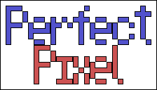

2D opengl game engine. Total rewrite of my old stuff.

## Dependencies
All external dependencies are added as submodules.

## Building

After cloning:
* `mkdir build && cd build`
* `cmake ..`
* Build with VS
* Debug the Pong project, or run the Pong executable in the output directory

Currently only Visual Studio 2017 on Windows will work. Only debug builds are tested.

## Todo

Short term:
* Rendering rework - Move sprite components off the old OO system, have the renderer query new components rather than pushing elements to the graphics manager
* Support for at least one more platform
